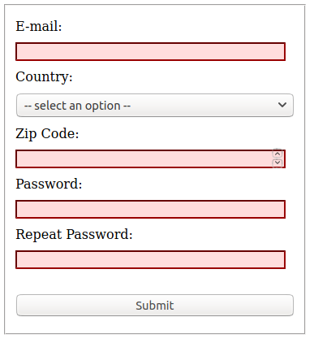
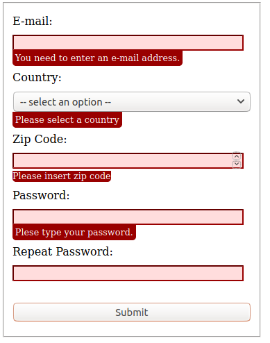

# Practice

A simple form using javascript to validate data. 

It displays error messages according to validation object using javascript.

It checks validation of password match and writes in into validation object.

## Screenshots

 
 

## More screenshots

[Here](Screenshots.md)

## Live Version

[Here](https://ivanderlich.github.io/JavascriptCustomFormValidation/)

## Requirements

- Linux

## Instalation

    git clone git@github.com:IvanDerlich/JavascriptCustomFormValidation.git

    cd JavascriptCustomFormValidation/

    xdg-open src/index.html  -> or Open manuallly

## Acknowledgement

Oding Project: for providing [this](https://www.theodinproject.com/courses/javascript/lessons/forms-javascript#project) guide that was used for this mini project
